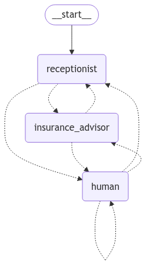

# Project: Chatbot for Manulife
This project implements a chatbot system designed to assist users with a variety of tasks, featuring the following key capabilities:  
- **Conversation memory**: Retains context across user interactions.  
- **Retrieval-Augmented Generation (RAG)**: Answers user questions by retrieving relevant information from documents.  
- **Internet search**: Handles queries requiring up-to-date or information beyond the knowledge of a large language model (LLM).

## Chatbot System Overview
The system is comprised of two specialized agents: **Receptionist** and **Insurance Advisor**, each tailored to handle different types of queries. 

### **Receptionist**
The Receptionist agent is responsible for:  
- Answering general questions that can be handled by a large language model (LLM).  
- Retrieving information from the 2023 Manulife Annual Report to address finance-related queries specific to Manulife.  
- Performing web searches to provide answers for questions outside its built-in knowledge base (e.g., "What is the current weather in Hong Kong?").  

### **Insurance Advisor**
The Insurance Advisor agent specializes in:  
- Offering personalized recommendations for purchasing any type of insurance package.  

## Agent Collaboration
The two agents work collaboratively as follows:  
- If a user's query **is not related to purchasing insurance**, the Receptionist agent provides the response.  
- If a user's query **concerns purchasing an insurance package**, the conversation is transferred to the Insurance Advisor for further assistance.

## State Graph
Below is a graphical representation of the chatbot system's workflow: 



## Technologies Used
- This project uses LangChain and LangGraph, among other dependencies.

## Code Base
- To explore the implementation, please refer to the notebook file `llm_demo.ipynb`.

## Sample Conversation
```markdown
Type 'exit' to end the conversation.
--- Conversation Turn 1 ---
You: hello!
receptionist: Hi there! How can I help you today?

--- Conversation Turn 2 ---
You: What is the total revenue in 2023 for manulife?
receptionist: Manulife's total revenue in 2023 was $48.739 billion.

--- Conversation Turn 3 ---
You: what is the weather in Hong Kong now?
receptionist: The weather in Hong Kong is currently clear with a temperature of 12.4°C. It is cold in the morning and will be very dry during the day with a maximum temperature of around 17 degrees. The wind is from the NNE at 16.2 kph.

--- Conversation Turn 4 ---
You: I want to buy insurance
insurance_advisor: Okay, I can help you with that! To give you the best recommendation, I need a little more information. What kind of insurance are you interested in? For example, are you looking for health, life, auto, or home insurance?

--- Conversation Turn 5 ---
You: what is life insurance?
insurance_advisor: Life insurance is a contract between you and an insurance company. In exchange for regular payments (premiums), the insurance company promises to pay a lump sum of money (the death benefit) to your chosen beneficiaries when you pass away.

Here's a breakdown of the key aspects:

**Purpose:**

*   **Financial Protection:** The primary purpose of life insurance is to provide financial security to your loved ones after you're gone. This can help them cover expenses like:
    *   Mortgage payments
    *   Living expenses
    *   Education costs for children
    *   Outstanding debts
    *   Funeral costs
*   **Peace of Mind:** Knowing that your family will be financially taken care of can provide significant peace of mind.
*   **Estate Planning:** Life insurance can also be a tool for estate planning, helping to manage taxes and ensure a smooth transfer of assets.

**Types of Life Insurance:**

There are two main categories of life insurance:

1.  **Term Life Insurance:**
    *   Provides coverage for a specific period (e.g., 10, 20, or 30 years).
    *   Generally more affordable than permanent life insurance.
    *   If you outlive the term, the coverage ends, and you may need to renew or purchase a new policy.
    *   Best for those who need coverage for a specific period, such as while raising children or paying off a mortgage.
2.  **Permanent Life Insurance:**
    *   Provides lifelong coverage.
    *   Premiums are typically higher than term life insurance.
    *   Builds cash value over time, which can be borrowed against or withdrawn.
    *   Includes types like whole life, universal life, and variable life insurance.
    *   Best for those who want lifelong coverage and the potential for cash value growth.

**Key Factors to Consider:**

*   **Coverage Amount:** How much money would your family need to maintain their lifestyle and cover their expenses if you were no longer there?
*   **Term Length (for term life):** How long do you need coverage?
*   **Your Age and Health:** These factors will affect your premium rates.
*   **Your Budget:** How much can you afford to pay in premiums?
*   **Your Beneficiaries:** Who will receive the death benefit?

**Benefits of Life Insurance:**

*   **Financial Security for Loved Ones:** Provides a safety net for your family.
*   **Debt Coverage:** Helps pay off outstanding debts.
*   **Estate Planning Tool:** Can help with tax management and asset transfer.
*   **Peace of Mind:** Knowing your family will be taken care of.
*   **Potential Cash Value Growth (for permanent policies):** Can be used for future needs.

Do you have any specific questions about life insurance that I can help you with? Or would you like me to help you explore different options based on your needs?

Ending the conversation. Goodbye!
```